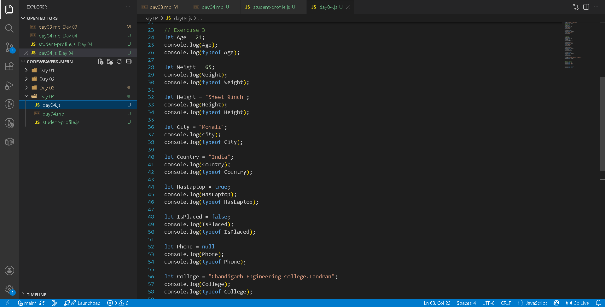
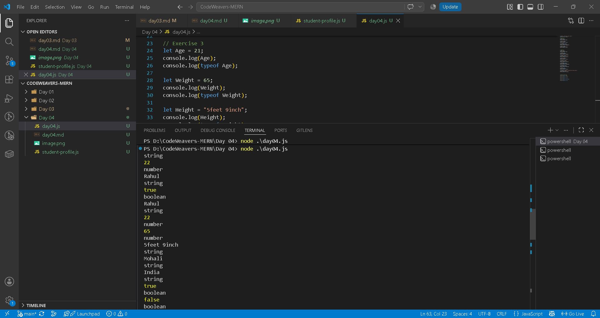
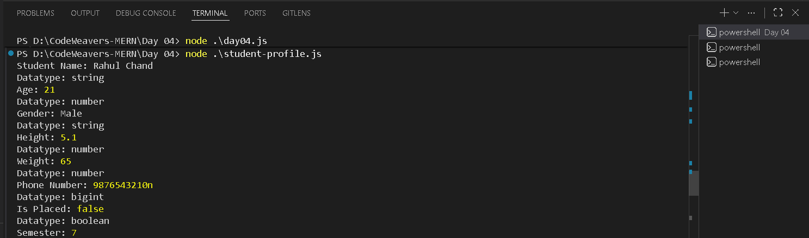
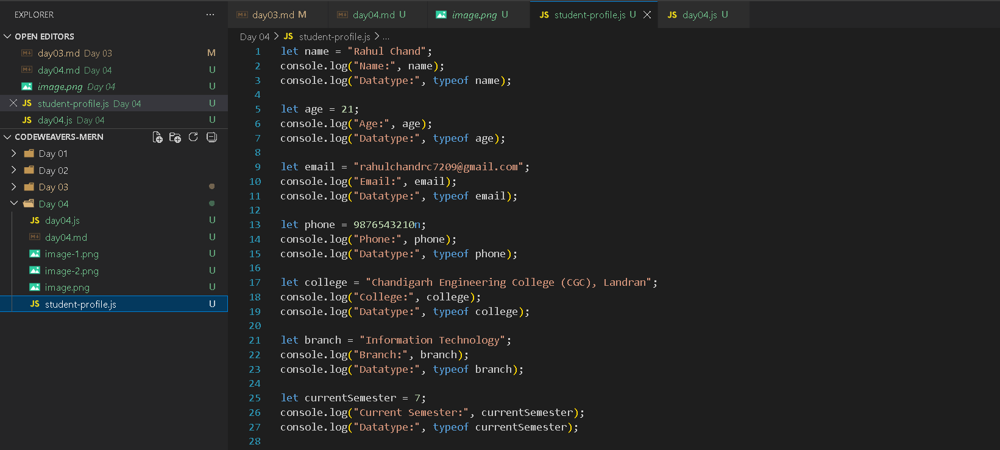

======================================

CodeWeavers Learning Operating System

Day 04 Engineering Lab

======================================

━━━━━━━━━━━━━━━━━━━━━━━━━━━━━━━━━━━━━━━━━━━━━━━━━━━━━━━━━━━━
⚡ CODEWEAVERS ENGINEERING LAB — DAY 04
Theme: What Kind of Information Can Programs Remember?
━━━━━━━━━━━━━━━━━━━━━━━━━━━━━━━━━━━━━━━━━━━━━━━━━━━━━━━━━━━━

🎯 MISSION BRIEF

Yesterday you learned how a program remembers information using variables.

Today your mission is to discover what kind of information those variables can store.

You are not memorizing JavaScript.
You are training yourself to think like a Software Engineer.

━━━━━━━━━━━━━━━━━━━━━━━━━━━━━━━━━━━━━━━━━━━━━━━━━━━━━━━━━━━━

📚 PREREQUISITES

✅ Variables
✅ let
✅ const
✅ console.log()
✅ Node.js
✅ VS Code

━━━━━━━━━━━━━━━━━━━━━━━━━━━━━━━━━━━━━━━━━━━━━━━━━━━━━━━━━━━━

🎯 LEARNING OUTCOMES

By the end of this lab you should be able to:

• Identify primitive data types
• Differentiate Number and String
• Explain Undefined and Null
• Use typeof confidently
• Predict program output
• Debug datatype mistakes

━━━━━━━━━━━━━━━━━━━━━━━━━━━━━━━━━━━━━━━━━━━━━━━━━━━━━━━━━━━━

🧠 WARM-UP

Classify these values before touching the keyboard.

25
"25"
true
false
null
undefined
"CodeWeavers"
99.9 

Write the datatype beside each value.

    25   - number datatype
    "25"  - String datatype
    true  - Boolean datatype
    false - Boolean datatype
    null - null datatype
    undefined - undefined datatype (an object)
    "CodeWeavers" - String
    99.9 - number

🔍 OBSERVATION ACTIVITY

Question:

Instagram stores:

Username - String datatype
Followers - number datatype
Verified - boolean
Bio - string

Identify the datatype of each field.

Repeat for:

• WhatsApp 
--> Name - String
--> mobile no. - bigInt datatype
--> Username - String
--> About - String
--> Links - string

• Banking App
--> Name - string
--> Account Number - BigInt/Number
--> IFSC Code - String
--> UID - String

• Amazon
--> Login Number - BigInt
--> Password - String
--> Address - String

• Student Portal
--> studentName - String
--> rollNo. - Number
--> CGPA - number
--> Address - String
--> collegeName - String

━━━━━━━━━━━━━━━━━━━━━━━━━━━━━━━━━━━━━━━━━━━━━━━━━━━━━━━━━━━━

💻 CODING EXERCISE 1

Create:

day04.js

Write:

let age = 22;
let name = "Rahul";
let isStudent = true;

Print each value.

━━━━━━━━━━━━━━━━━━━━━━━━━━━━━━━━━━━━━━━━━━━━━━━━━━━━━━━━━━━━

💻 CODING EXERCISE 2

Print datatype of every variable.

Example:

console.log(typeof age);

Repeat for every variable.

━━━━━━━━━━━━━━━━━━━━━━━━━━━━━━━━━━━━━━━━━━━━━━━━━━━━━━━━━━━━

💻 CODING EXERCISE 3

Create variables for:

Name
Age
Weight
Height
City
Country
HasLaptop
IsPlaced
Phone = null
College

Print both:

Value

Datatype

━━━━━━━━━━━━━━━━━━━━━━━━━━━━━━━━━━━━━━━━━━━━━━━━━━━━━━━━━━━━

🎲 PREDICT BEFORE RUNNING

Predict the output first.

console.log(typeof 100);

console.log(typeof "100");

console.log(typeof true);

console.log(typeof undefined);

console.log(typeof null);

After prediction, execute and compare.

⚠️ Never skip prediction.

console.log(typeof 100); --> Number

console.log(typeof "100"); --> String

console.log(typeof true); --> Boolean

console.log(typeof undefined); -->Undefined

console.log(typeof null); --> Object

🐞 DEBUGGING MISSION

Fix every bug.
let age = "20";

Expected: Age should be Number.
--> let age = 20;
--------------------------------

let isStudent = "true";

Expected: Boolean.
--> let isStudent = true;
--------------------------------

let city;
console.log(typeof city);

Explain the output.
--> Output is undefined as value is not assigned to city.
--------------------------------

let phone = null;
console.log(typeof phone);

Explain why JavaScript prints "object".
--> As we know JS is built only in 10days, so there is so many bugs and it remains unfixed because many of the website are already made using JS then all get crashed.

(Hint: Historical language behavior.)

━━━━━━━━━━━━━━━━━━━━━━━━━━━━━━━━━━━━━━━━━━━━━━━━━━━━━━━━━━━━

🧩 ENGINEERING CHALLENGE

Create:

student-profile.js

Store at least 15 pieces of information.

Rules:

• Use meaningful names
• Use different datatypes
• Print every value
• Print every datatype

━━━━━━━━━━━━━━━━━━━━━━━━━━━━━━━━━━━━━━━━━━━━━━━━━━━━━━━━━━━━

🚀 MINI PROJECT

Title:

Student Digital Identity

Fields:

Name
Age
Email
Phone
College
Branch
Current Semester
CGPA
IsHosteller
HasScholarship
BloodGroup
GitHubUsername
LinkedInProfile
FavouriteLanguage
DreamCompany

Print every field and its datatype.

━━━━━━━━━━━━━━━━━━━━━━━━━━━━━━━━━━━━━━━━━━━━━━━━━━━━━━━━━━━━

🏆 PORTFOLIO EVIDENCE

Capture:

□ Screenshot of code

□ Screenshot of output

□ Screenshot of terminal

□ Reflection (5–8 lines)

Commit everything to your Git repository.

━━━━━━━━━━━━━━━━━━━━━━━━━━━━━━━━━━━━━━━━━━━━━━━━━━━━━━━━━━━━

📝 REFLECTION JOURNAL

Answer honestly.
Which datatype confused you most?
--> Null

What mistake did you make today?
-->when i want to print Age, i write their age so it gives otuput of age variable but i want output of Age.

What did you learn from debugging?
--> Small mistakes happen during code writing, debugging should fixed it.

Where are datatypes used in real software?
--> It ensure data is stored, processed and manipulated across every layer of software

Rate today's understanding out of 10.
10/10

━━━━━━━━━━━━━━━━━━━━━━━━━━━━━━━━━━━━━━━━━━━━━━━━━━━━━━━━━━━━

⭐ MENTOR EVALUATION RUBRIC

Knowledge ⭐⭐⭐⭐⭐
Reasoning ⭐⭐⭐⭐⭐
Coding ⭐⭐⭐⭐⭐
Prediction ⭐⭐⭐⭐⭐
Debugging ⭐⭐⭐⭐⭐
Communication ⭐⭐⭐⭐⭐

Mentor Remarks:
--> Consistently learning Javascript concepts, completes all lab exercises and shows steady improvement in coding and logical thinking.

━━━━━━━━━━━━━━━━━━━━━━━━━━━━━━━━━━━━━━━━━━━━━━━━━━━━━━━━━━━━

📖 HOMEWORK

Create profile.js.

Store at least 20 variables using all primitive datatypes learned today.

Print:

• Value
• Datatype

Challenge yourself to avoid every beginner mistake discussed in class.

━━━━━━━━━━━━━━━━━━━━━━━━━━━━━━━━━━━━━━━━━━━━━━━━━━━━━━━━━━━━

💡 ENGINEERING PRINCIPLES

✔ Understand before memorizing.
✔ Predict before running.
✔ Read errors completely.
✔ Use meaningful names.
✔ Debug systematically.
✔ Write code for humans first.

━━━━━━━━━━━━━━━━━━━━━━━━━━━━━━━━━━━━━━━━━━━━━━━━━━━━━━━━━━━━

🔮 TOMORROW'S MISSION

Question:

"What can a program do with the information it stores?"

Topics:

• Arithmetic Operators
• Assignment Operators
• Comparison Operators
• Logical Operators
• Increment
• Decrement

===============================
End of Day 04 Engineering Lab
===============================